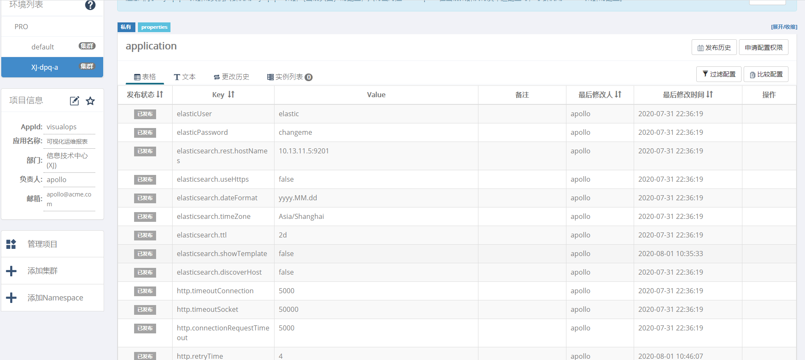

# Apollo对接与配置 (非spring boot项目)
本文介绍在非spring boot项目中，bboss与Apollo对接与配置方法。

# 1.添加Apollo和bbossEs相关依赖

maven项目pom.xml添加Apollo和bbossEs相关依赖
```xml
<dependency>
    <groupId>com.bbossgroups.plugins</groupId>
    <artifactId>bboss-elasticsearch-rest-jdbc</artifactId>
    <version>6.1.9</version>
     <!--排除bboss-elasticsearch-rest-booter包-->
    <exclusions>
        <exclusion>
            <artifactId>bboss-elasticsearch-rest-booter</artifactId>
            <groupId>com.bbossgroups.plugins</groupId>
        </exclusion>
    </exclusions>
</dependency>
<dependency>
    <groupId>com.bbossgroups.plugins</groupId>
    <artifactId>bboss-plugin-apollo</artifactId>
    <version>5.7.6</version>
</dependency>
```

 注意：一定要排除bboss-elasticsearch-rest-booter包

# 2.增加app.properties文件 
在应用resources/META-INF目录下面增加app.properties文件，内容如下：

```properties
# apollo应用id
app.id=visualops
# apollo应用地址
apollo.meta=http://10.13.11.7:8080
```

# 3.增加elasticsearch-boot-config.xml
在resources/conf下新增文件elasticsearch-boot-config.xml，内容如下：

```xml
<properties>
    <!--
       指定apollo属性配置namespace
    -->

    <config apolloNamespace="application"/>
 </properties>
```

# 4.增加server.properties文件
在C:\opt\settings（windows）或者/opt/settings(linux)新增文件server.properties，内容如下：

```properties
# 环境配置
env=PRO
#集群编号
idc=XJ-dpq-a
```


# 5.Apollo中创建项目和namespace
应用名称：visualops

es服务器的相关信息，那么就可以创建一个名为application的namespace，其中主要配置信息如下：
```properties
elasticsearch.rest.hostNames = ip:9200

elasticsearch.dateFormat = yyyy.MM.dd

elasticsearch.timeZone = Asia/Shanghai

elasticsearch.ttl = 2d

#在控制台输出脚本调试开关showTemplate,false关闭，true打开，同时log4j至少是info级别

elasticsearch.showTemplate = true

elasticsearch.discoverHost = false

# dsl配置文件热加载扫描时间间隔，毫秒为单位，默认5秒扫描一次，<= 0时关闭扫描机制

dslfile.refreshInterval = -1

##es client http连接池配置

http.timeoutConnection = 50000

http.timeoutSocket = 50000

http.connectionRequestTimeout = 50000

http.retryTime = 1

http.maxLineLength = -1

http.maxHeaderCount = 200

http.maxTotal = 400

http.defaultMaxPerRoute = 200

http.soReuseAddress = false

http.soKeepAlive = false

http.timeToLive = 3600000

http.keepAlive = 3600000
```



# 6.完成上述操作之后，就可以正常使用bbosses的api了

# 7.bboss中使用apollo管理属性的其他作用
##  7.1 IOC与apollo集成并管理属性案例
```xml
<properties>
    <config apolloNamespace="application" changeReload="false"/>
    <property name="default" class="org.frameworkset.nosql.redis.RedisDB">
        <!-- redis.servers为apollo中配置的属性 -->
        <property name="servers">
            ${redis.servers}
        </property>
        <!-- single|cluster -->
        <property name="mode" value="cluster" />
        <property name="auth" value="${redis.auth:}" />
        <property name="poolMaxTotal" value="${redis.poolMaxTotal:10}"/>
        <property name="poolMaxWaitMillis" value="${redis.poolMaxWaitMillis:2000}"/>
    </property>
</properties>
```
config元素支持的属性说明

apolloNamespace 指定apollo namespace，多个用逗号分隔
changeReload   指定是否热加载修改后的属性，true 加载， false不加载，热加载时IOC中的属性和组件都会重新初始化
configChangeListener 指定自己的apollo值变化监听器
## 7.2 在代码中直接加载apollo中的配置

```java
public class ApolloPropertiesFilePluginTest{
   private static Logger logger = LoggerFactory.getLogger(ApolloPropertiesFilePlugin.class);
   PropertiesContainer propertiesContainer ;
   @Before
   public void init(){
      propertiesContainer = new PropertiesContainer();
      propertiesContainer.addConfigPropertiesFromApollo("application",//apollo namespace
                                                        true); //true标识热加载修改后的属性，否则不热加载
   }
   @Test
   public void test(){
      dbinfo("");
      dbinfo("ecop.");
      while(true){
         try {
            synchronized (this) {
               Thread.currentThread().wait(1000l);
            }
         }
         catch (Exception e){

         }
      }

   }

   private void dbinfo(String dbname){
      String dbName  = propertiesContainer.getProperty(dbname+"db.name");
      String dbUser  = propertiesContainer.getProperty(dbname+"db.user");
      String dbPassword  = propertiesContainer.getProperty(dbname+"db.password");
      String dbDriver  = propertiesContainer.getProperty(dbname+"db.driver");
      String dbUrl  = propertiesContainer.getProperty(dbname+"db.url");

      String showsql  = propertiesContainer.getProperty(dbname+"db.showsql");
      String validateSQL  = propertiesContainer.getProperty(dbname+"db.validateSQL");
      String dbInfoEncryptClass = propertiesContainer.getProperty(dbname+"db.dbInfoEncryptClass");
      System.out.println("dbName:"+dbName);
      System.out.println("dbUser:"+dbUser);
      System.out.println("dbPassword:"+dbPassword);
      System.out.println("dbDriver:"+dbDriver);
      System.out.println("dbUrl:"+dbUrl);
      System.out.println("showsql:"+showsql);
      System.out.println("validateSQL:"+validateSQL);
      System.out.println("dbInfoEncryptClass:"+dbInfoEncryptClass);
   }
}
```
## 7.3 http proxy中加载apollo中配置案例

```java
HttpRequestProxy.startHttpPoolsFromApollo("application");//加载http协议配置
```

# 8.参考文档

[Spring boot整合Elasticsearch](https://esdoc.bbossgroups.com/#/spring-booter-with-bboss?id=spring-boot整合elasticsearch案例分享)

[Apollo Java客户端使用指南](https://github.com/ctripcorp/apollo/wiki/Java客户端使用指南)