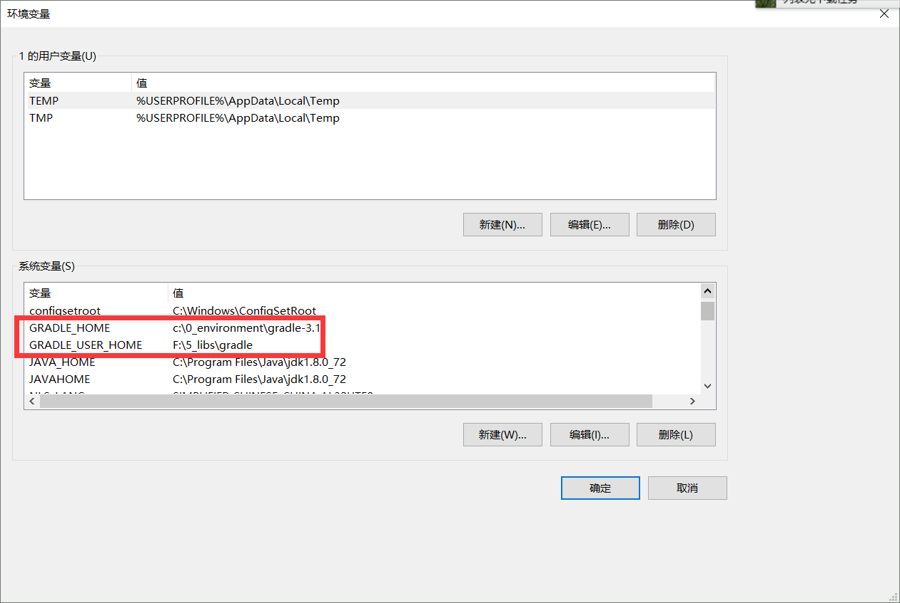
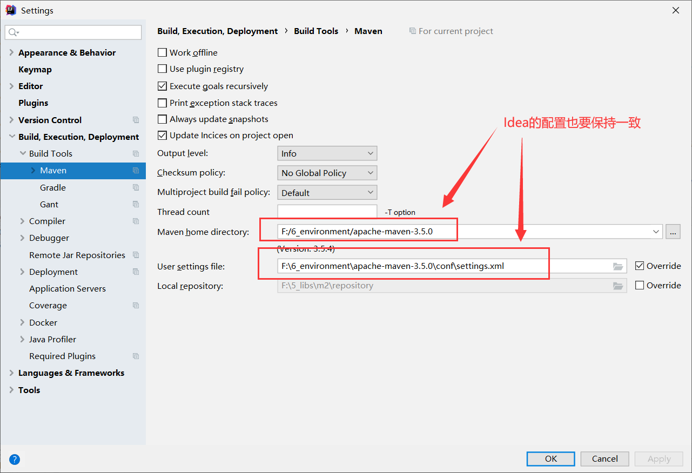

# Elasticsearch Bboss源码构建

# Gradle安装和配置

在自己的电脑上装好gradle运行环境,下载**最新**的gradle版本：

[下载gradle](https://gradle.org/releases) 


下载完毕后解压，然后配置好gradle环境变量： 

GRADLE_HOME:  指定gradle安装目录

GRADLE_USER_HOME: 指定gradle从maven中央库下载依赖包本地存放目录 

M2_HOME: 一般还需要通过M2_HOME指定maven安装地址，这样gradle 构建的本地包才能被maven项目引用到，gradle 通过M2_HOME环境变量查找maven安装目录，一定要与idea或者eclipse中配置的maven安装目录一致




一般还需要通过M2_HOME指定maven安装地址，这样gradle 构建的本地包才能被maven项目引用到，gradle 通过M2_HOME环境变量查找maven安装环境，一定要与idea或者eclipse中配置的maven安装目录一致，配置M2_HOME环境变量如下图： 


M2_HOME变量中的maven安装路径要与idea中maven配置保持一致,进入setting，配置maven：



新版本的idea必须调整导入工程的gradle配置，进入setting，设置工程的gradle配置：


# 构建Elasticsearch bboss源码

安装后gradle后，我们就可以利用gradle来构建Elasticsearch Bboss的源码了。

从以下地址依次下载和构建bboss相关源码工程：

https://gitee.com/bboss/bboss

https://gitee.com/bboss/bboss-data

https://gitee.com/bboss/bboss-http

https://gitee.com/bboss/bboss-plugins

https://gitee.com/bboss/bboss-elastic

https://gitee.com/bboss/bboss-elastic-tran  

然后分别按顺序在命令行源码根目录执行gradle publishToMavenLocal指令构建bboss 源码：

```shell
cd bboss
gradle publishToMavenLocal

cd bboss-data
gradle publishToMavenLocal

cd bboss-http
gradle publishToMavenLocal

cd bboss-plugins
gradle publishToMavenLocal


cd bboss-elastic
gradle publishToMavenLocal

cd bboss-elastic-tran
gradle publishToMavenLocal
```

# 开发交流


bboss elasticsearch交流QQ群：21220580,166471282

**bboss elasticsearch微信公众号：**


