# ES数据导出并发送到Kafka案例

本文介绍基于bboss 实现es数据导出并发送到Kafka案例。

# 1.bboss同步工具介绍

bboss数据同步可以方便地实现多种数据源之间的数据同步功能，**支持增、删、改数据同步**，本文介绍各种数据同步案例（支持各种数据库和各种es版本）


通过bboss，可以非常方便地实现：

1. 将数据库表数据同步到Elasticsearch
2. 将数据库表数据同步到数据库表
3. 将Elasticsearch数据同步到数据库表
4. 将Elasticsearch数据同步到Elasticsearch
5. 将mongodb数据同步到Elasticsearch
6. 将mongodb数据同步到数据库表
7. kafka数据导入Elasticsearch和数据库，支持kafka_2.12-0.10.2.0系列版本和kafka_2.12-2.3.0 系列版本
8. HBase数据导入Elasticsearch
9. 将elasticsearch数据导出到文本文件以及通过ftp/sftp上传文件到文件服务器
10. 将数据库表数据导出到文本文件以及通过ftp/sftp上传文件到文件服务器
11. 将elasticsearch数据导出发送到Kafka服务器
12. 将数据库表数据发送到Kafka服务器

# 2.准备工作

准备工作：

1).下载同步作业开发环境工程（基于gradle管理）

https://gitee.com/bboss/kafka2x-elasticsearch

2).我们用gradle和idea作为构建和开发环境，下载后需导入idea，环境搭建参考文档：

https://esdoc.bbossgroups.com/#/bboss-build

假设工程已经导入idea


这是工程对应的idea gradle配置,导入后立马按照下面的配置进行调整，不要等idea导入完成后再调整


3) 根据kafka版本修改kafka客户端的版本号

根据kafka服务端版本，修改[gradle.properties](https://gitee.com/bboss/kafka2x-elasticsearch/blob/master/gradle.properties)中kafka客户端的版本号

kafka2x=1.1.0     --- kafka 1.x客户端版本号

kafka2x=2.3.0      --- kafka 2.x客户端版本号

kafka2x=3.2.0      --- kafka 3.x客户端版本号

bboss kafka数据同步插件gradle依赖包 
  
```java
       api(
				[group: 'com.bbossgroups.plugins', name: 'bboss-datatran-kafka2x', version: "${bboss_es_version}", transitive: true],
		)
		api (
				[group: 'org.apache.kafka', name: 'kafka_2.12', version: "${kafka2x}", transitive: true],
		){
			exclude group: 'log4j', module: 'log4j'
			exclude group: 'org.slf4j', module: 'slf4j-log4j12'
		}

		api ([group: 'org.apache.kafka', name: 'kafka-tools', version: "${kafka2x}", transitive: true],){
			exclude group: 'log4j', module: 'log4j'
			exclude group: 'org.slf4j', module: 'slf4j-log4j12'
			exclude group: 'org.eclipse.jetty', module: 'jetty-server'

			exclude group: 'org.eclipse.jetty', module: 'jetty-servlets'

			exclude group: 'org.eclipse.jetty', module: 'jetty-servlet'
			exclude group: 'org.glassfish.jersey.containers', module: 'jersey-container-servlet'
		}

		api ([group: 'org.apache.kafka', name: 'kafka-clients', version: "${kafka2x}", transitive: true],){
			exclude group: 'log4j', module: 'log4j'
			exclude group: 'org.slf4j', module: 'slf4j-log4j12'
		}

		api ([group: 'org.apache.kafka', name: 'kafka-streams', version: "${kafka2x}", transitive: true],){
			exclude group: 'log4j', module: 'log4j'
			exclude group: 'org.slf4j', module: 'slf4j-log4j12'
		}
```

# 3.案例介绍

接下来在源码目录下面创建增量导出elasticsearch数据并发送kafka同步作业类ES2KafkaDemo

1).定义main方法
2).定义同步方法scheduleTimestampImportData

main方法将作为作业执行入口方法

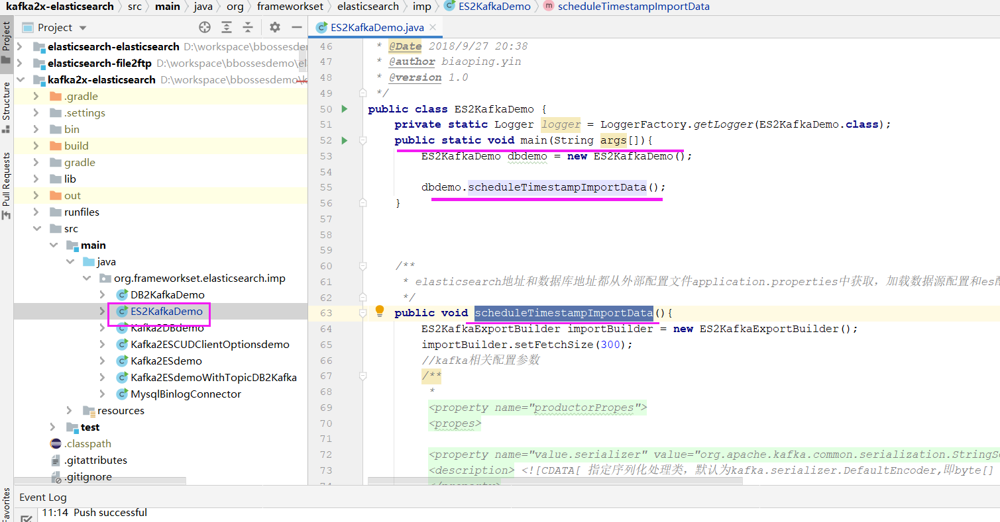

接下来在同步方法scheduleTimestampImportData中定义同步作业逻辑

先定义作业构建器

```java
ES2KafkaExportBuilder importBuilder = new ES2KafkaExportBuilder();
设置从elasticsearch批量拉取数据的记录数（根据实际情况调整）
importBuilder.setFetchSize(300);
```


接下来做kafka相关配置参数

```java
		// kafka服务器参数配置
		// kafka 2x 客户端参数项及说明类：org.apache.kafka.clients.consumer.ConsumerConfig
		KafkaOutputConfig kafkaOutputConfig = new KafkaOutputConfig();
		kafkaOutputConfig.setTopic("es2kafka");//设置kafka主题名称
		kafkaOutputConfig.addKafkaProperty("value.serializer","org.apache.kafka.common.serialization.StringSerializer");
		kafkaOutputConfig.addKafkaProperty("key.serializer","org.apache.kafka.common.serialization.LongSerializer");
		kafkaOutputConfig.addKafkaProperty("compression.type","gzip");
		kafkaOutputConfig.addKafkaProperty("bootstrap.servers","192.168.137.133:9092");
		kafkaOutputConfig.addKafkaProperty("batch.size","10");
//		kafkaOutputConfig.addKafkaProperty("linger.ms","10000");
//		kafkaOutputConfig.addKafkaProperty("buffer.memory","10000");
		kafkaOutputConfig.setKafkaAsynSend(true);
		kafkaOutputConfig.setLogsendTaskMetric(1000l);//设置发送多少条消息后打印发送kafka统计信息
```


具体的kafka配置参数可以参考kafka官方文档,


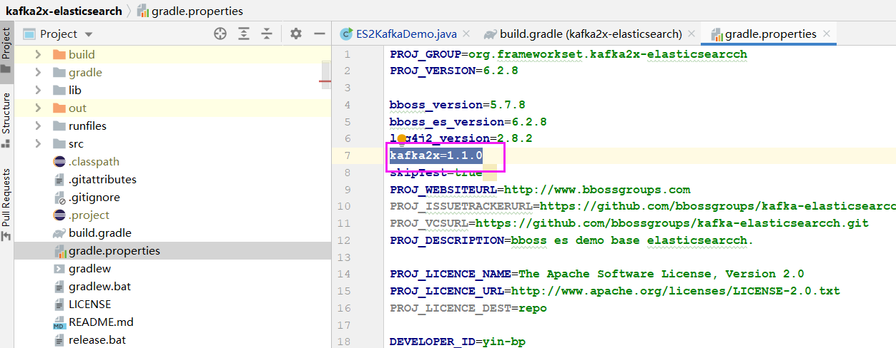

kafka2x=1.1.0
这个是kafka客户端的版本号，可以根据实际kafka版本进行调整。

配置好kafka参数后，接下来配置发往kafka的消息格式处理器（不设置默认采用json格式发送）：


```java
public void buildRecord(Context taskContext, CommonRecord record, Writer builder) {
				//record.setRecordKey("xxxxxx"); //指定记录key
				//直接将记录按照json格式输出到文本文件中
				SerialUtil.normalObject2json(record.getDatas(),//获取记录中的字段数据并转换为json格式
						builder);
				String data = (String)taskContext.getTaskContext().getTaskData("data");//从任务上下文中获取本次任务执行前设置时间戳
//          System.out.println(data);

			}
```

可以在buildRecord方法里面做：
1.设置记录的kafka key
2.调用record.getDatas()方法去除当前的记录Map<key,value>
转换为自己的记录格式写入builder.write中
3.从context中获取任务级别的变量参数

接下来将kafkaOutputConfig配置对象放入作业构建器importBuilder
importBuilder.setKafkaOutputConfig(kafkaOutputConfig);

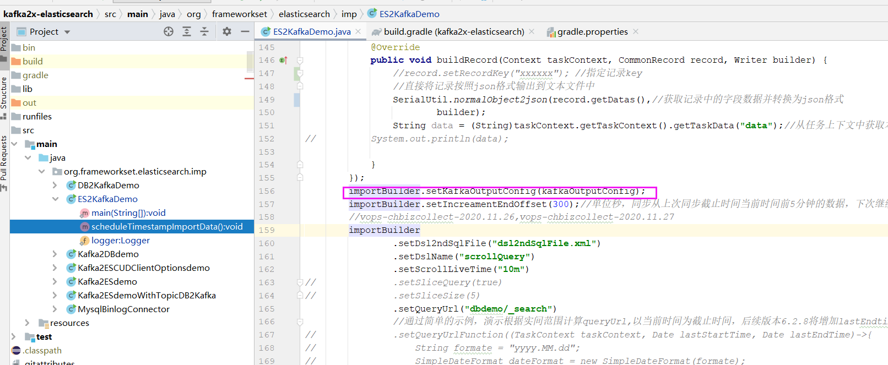

接下来设置增量同步时间戳截止时间偏移量（相对应当前时间）
importBuilder.setIncreamentEndOffset(300);//单位秒，同步从上次同步截止时间当前时间前5分钟的数据，下次继续从上次截止时间开始同步数据


这个主要是考虑到es写入数据的延迟性，避免增量导出时遗漏数据。

接下来做es导出的相关配置：dsl，dsl对应文件路径，以及queryaction，dsl需要用到的条件变量值：


dsl2ndSqlFile.xml配置配置了scrollQuery dsl语句


设置scrollLiveTime来配置scroll查询context有效期:10m(10分钟)

通过setQueryUrl来直接指定检索的es 索引rest地址

```java
importbuilder.setQueryUrl("dbdemo/_search")
```

也可以动态指定：

```java
importbuilder.setQueryUrlFunction((TaskContext taskContext, Date lastStartTime, Date lastEndTime)->{
					String formate = "yyyy.MM.dd";
					SimpleDateFormat dateFormat = new SimpleDateFormat(formate);
					String startTime = dateFormat.format(lastEndTime);
					Date endTime = new Date();
					String endTimeStr = dateFormat.format(endTime);
					return "dbdemo-"+startTime+ ",dbdemo-"+endTimeStr+"/_search";
//					return "vops-chbizcollect-2020.11.26,vops-chbizcollect-2020.11.27/_search";
				})
```

通过addParam添加dsl需要用得到的变量参数值：

```java
importbuilder.addParam("var1","v1")
				.addParam("var2","v2")
				.addParam("var3","v3");
```

在dsl中直接引用即可：

```json
 {
              "term": {
                "var1.keyword": #[var1]
              }
            },
            {
              "term": {
                "var2.keyword": #[var2]
              }
            },
            {
              "term": {
                "var3.keyword": #[var3]
              }
            },
```

设置es数据源名称默认为default：

```java
importBuilder.setSourceElasticsearch("default");
```

es数据源在application.properties文件中配置


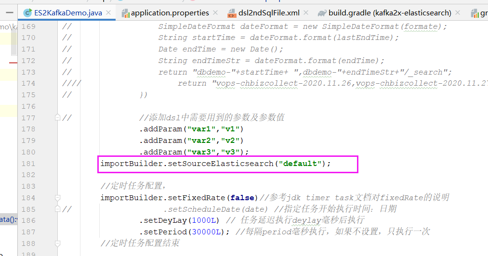

定时任务配置

延迟1秒执行，每隔30秒执行一次

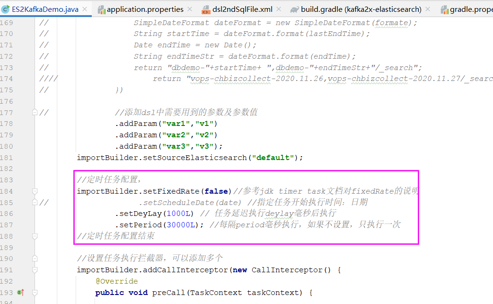

接下来设置任务执行拦截器

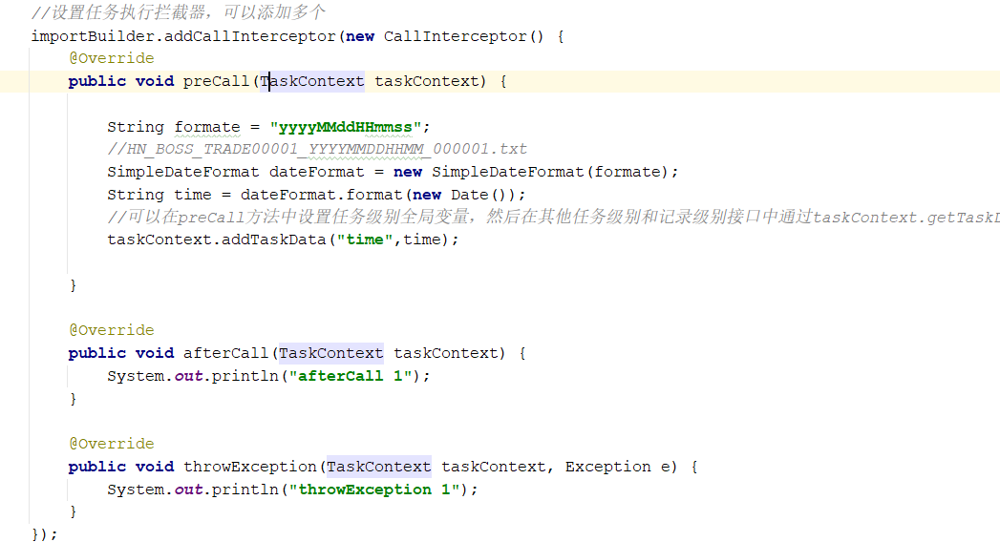

//可以在preCall方法中设置任务级别全局变量，然后在其他任务级别和记录级别接口中通过

```java
taskContext.getTaskData("time");方法获取time参数
				taskContext.addTaskData("time",time);
```

下面是设置采集数据增量时间戳对应的elasticsearch字段名称、任务重启是否重新开始同步数据、增量状态保存文件路径、增量字段类型等信息，以及增量起始值等信息

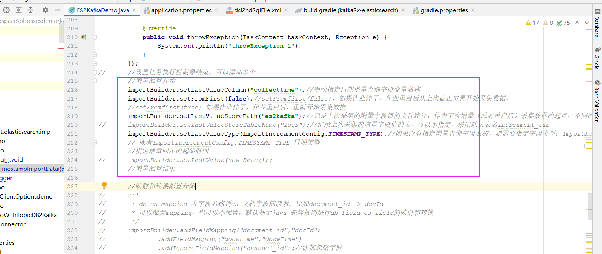

设置ip地址信息库地址


全局往每条记录中添加字段：


通过setDataRefactor接口修改每条记录中的字段值

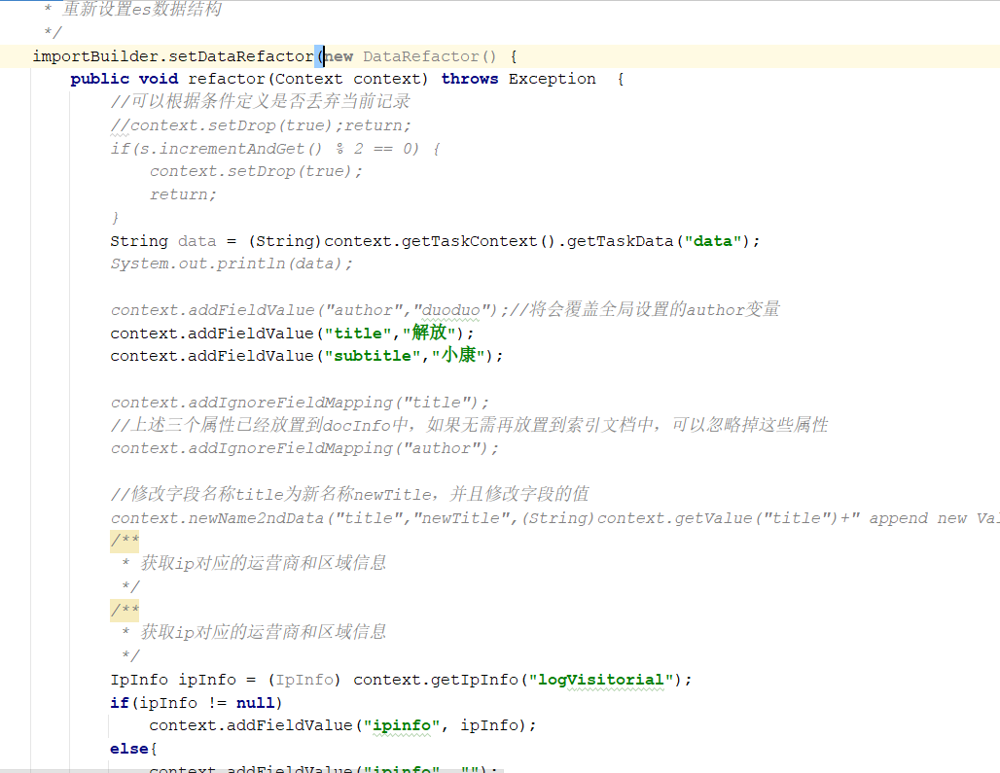

获取logVisitorial字段中的ip值对应的运营商和区域信息


添加记录采集同步时间


添加任务执行结果回调函数，如果任务执行有错误发生，就会调用error方法或者exception方法，对应排查数据同步中各种问题非常有用：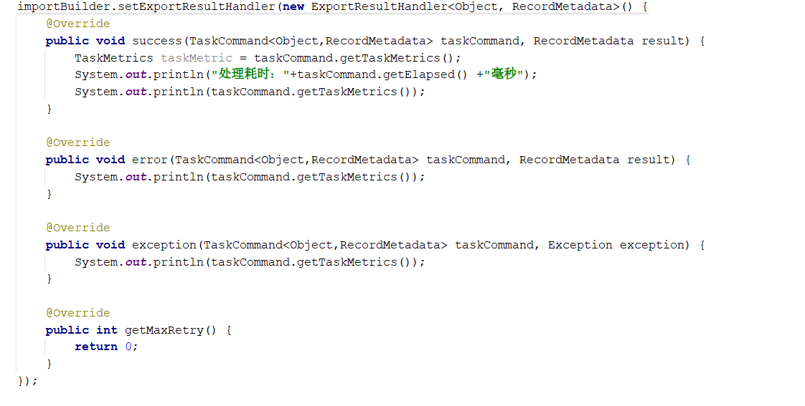

其他配置：打印日志设置，任务报错继续执行设置


这样我们这个作业就配置好了，下面的代码构建和启动导出elasticsearch数据并发送kafka同步作业


```java
/**
		 * 构建和启动导出elasticsearch数据并发送kafka同步作业
		 */
		DataStream dataStream = importBuilder.builder();
		dataStream.execute();
```

任务定义好后，接下来说明一下任务的调试方法，直接用idea debug类ES2KafkaDemo的main方法即可


确保kafka和es已经启动,直接鼠标右键run或者debug即可


任务运行过程中，打印的日志：


调试好作业后，说一下，我们要如何发布作业

先修改工程application.properties文件中的mainclass配置为我们要执行的作业：org.frameworkset.elasticsearch.imp.ES2KafkaDemo

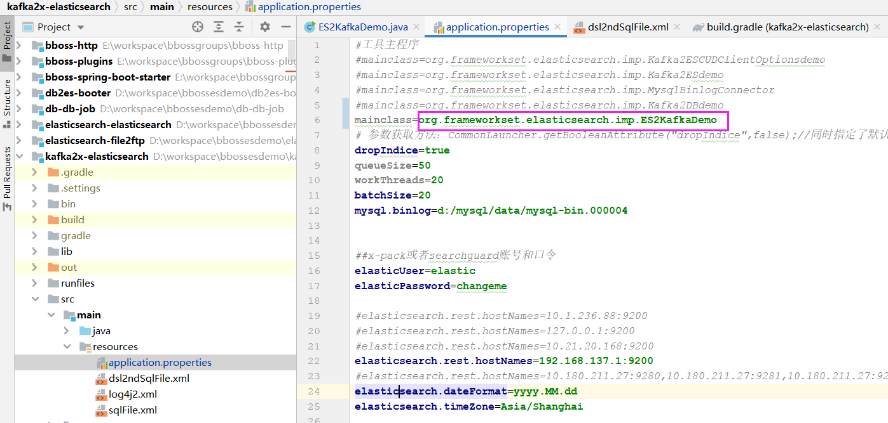

然后运行工程根目录下的release.bat命令：

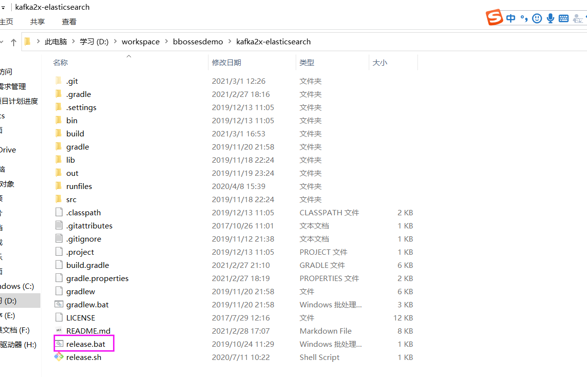

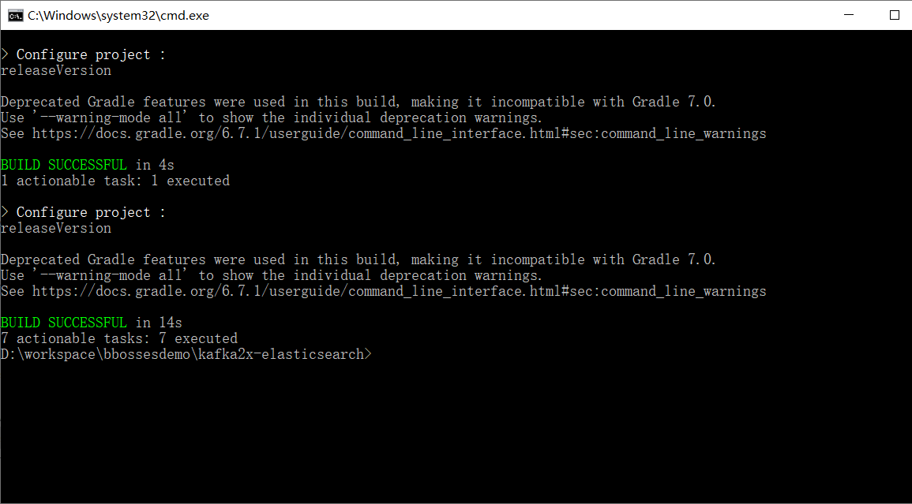

这样表示同步作业构建发布成功，build\distributions下面有发布出来的包：


解压，运行下面的restart.bat或者restart.sh指令即可


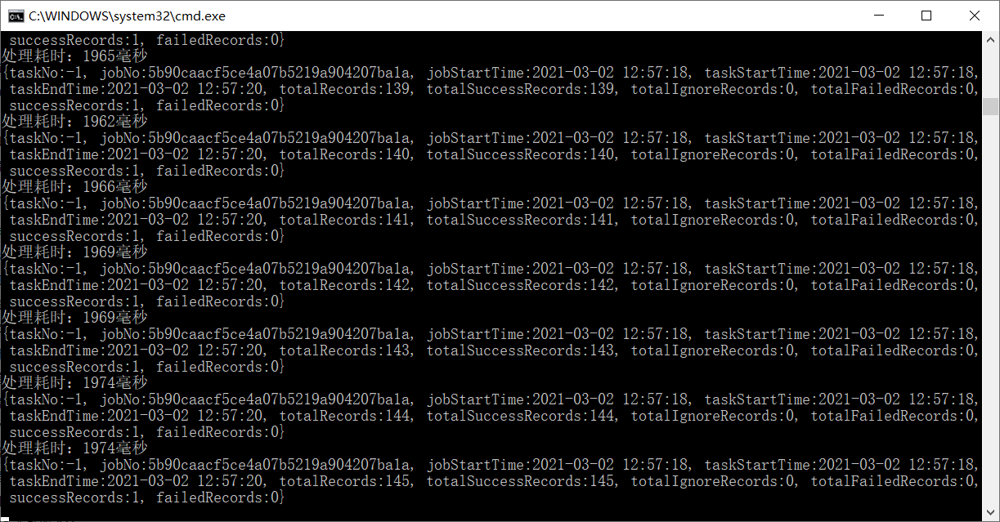

作业执行需要的jvm内存可以修改jvm.options文件进行调整


其他配置在resources目录下面：


案例介绍就到这里，谢谢大家关注bboss。