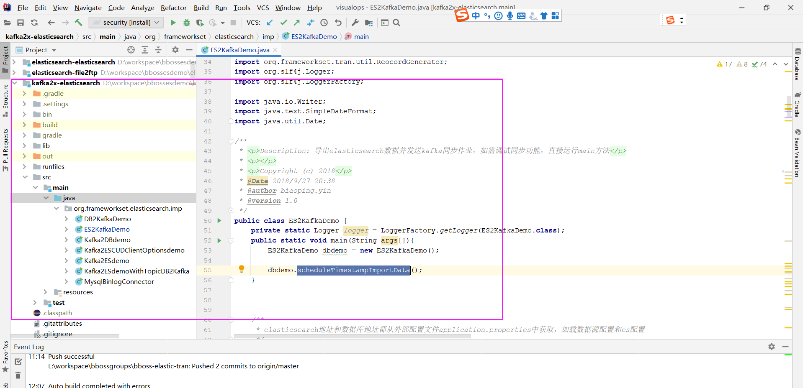
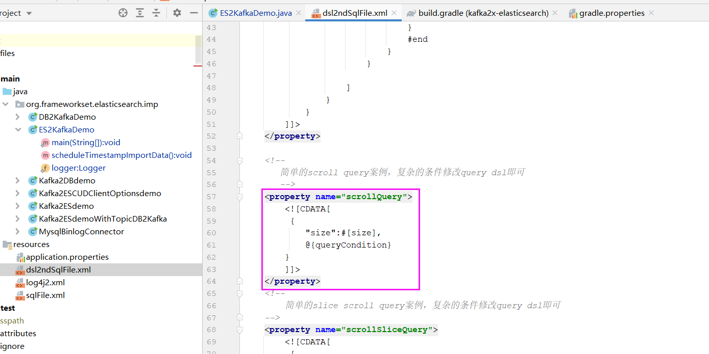
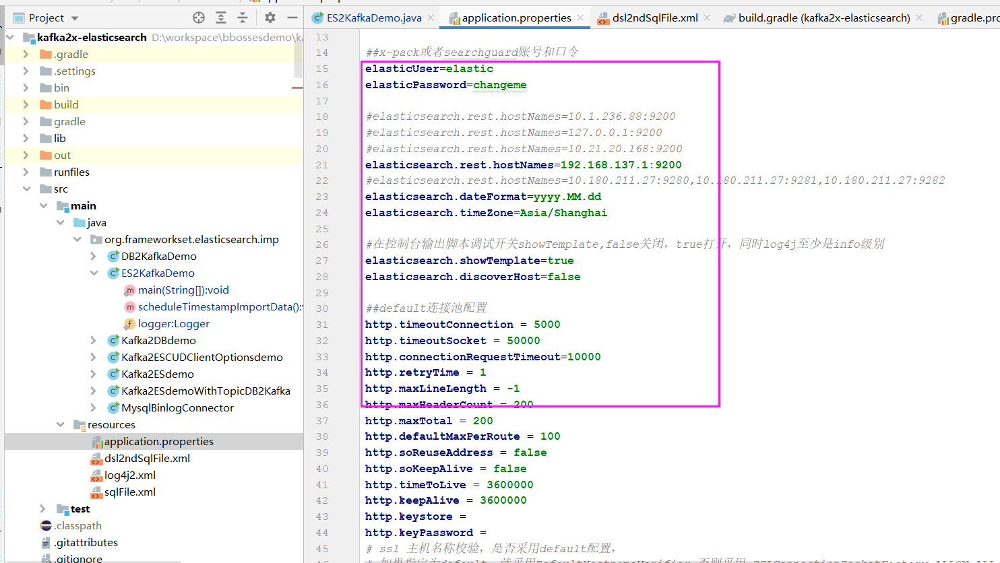
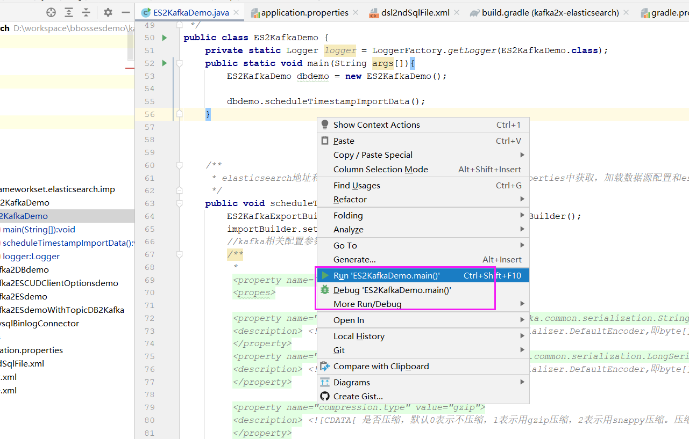
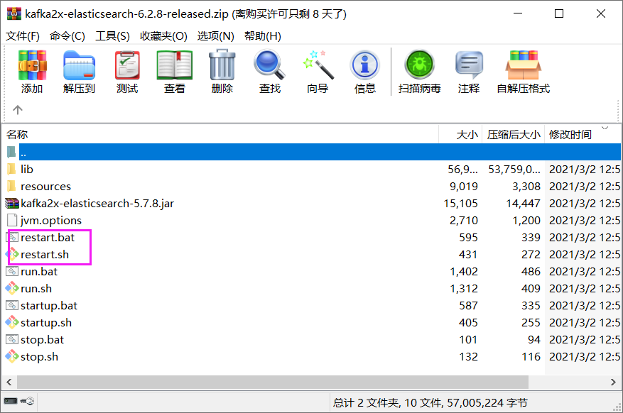
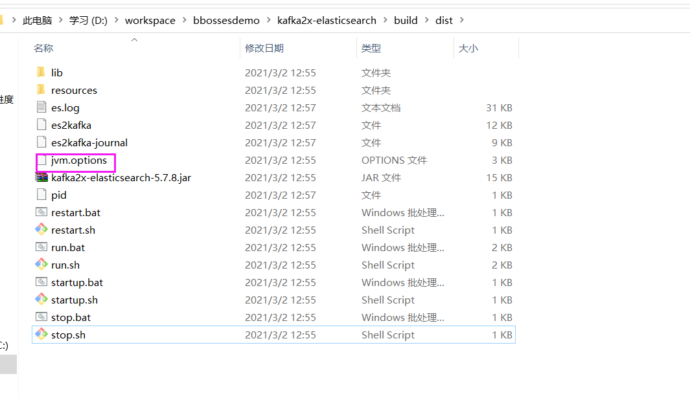

# ES数据导出并发送到Kafka案例

本文介绍基于bboss 实现es数据导出并发送到Kafka案例。

# 1.bboss同步工具介绍

bboss数据同步可以方便地实现多种数据源之间的数据同步功能，**支持增、删、改数据同步**，本文介绍各种数据同步案例（支持各种数据库和各种es版本）


通过bboss，可以非常方便地实现：

1. 将数据库表数据同步到Elasticsearch
2. 将数据库表数据同步到数据库表
3. 将Elasticsearch数据同步到数据库表
4. 将Elasticsearch数据同步到Elasticsearch
5. 将mongodb数据同步到Elasticsearch
6. 将mongodb数据同步到数据库表
7. kafka数据导入Elasticsearch和数据库，支持kafka_2.12-0.10.2.0系列版本和kafka_2.12-2.3.0 系列版本
8. HBase数据导入Elasticsearch
9. 将elasticsearch数据导出到文本文件以及通过ftp/sftp上传文件到文件服务器
10. 将数据库表数据导出到文本文件以及通过ftp/sftp上传文件到文件服务器
11. 将elasticsearch数据导出发送到Kafka服务器
12. 将数据库表数据发送到Kafka服务器

# 2.准备工作

准备工作：

1).下载同步作业开发环境工程（基于gradle管理）

https://gitee.com/bboss/kafka2x-elasticsearch

2).我们用gradle和idea作为构建和开发环境，下载后需导入idea，环境搭建参考文档：

https://esdoc.bbossgroups.com/#/bboss-build

假设工程已经导入idea



这是工程对应的idea gradle配置,导入后立马按照下面的配置进行调整，不要等idea导入完成后再调整


3) 根据kafka版本修改kafka客户端的版本号

根据kafka服务端版本，修改[gradle.properties](https://gitee.com/bboss/kafka2x-elasticsearch/blob/master/gradle.properties)中kafka客户端的版本号

kafka2x=1.1.0     --- kafka 1.x客户端版本号

kafka2x=2.3.0      --- kafka 2.x客户端版本号

kafka2x=3.2.0      --- kafka 3.x客户端版本号

bboss kafka数据同步插件gradle依赖包 

```java
       api(
				[group: 'com.bbossgroups.plugins', name: 'bboss-datatran-kafka2x', version: "${bboss_es_version}", transitive: true],
		)
		api (
				[group: 'org.apache.kafka', name: 'kafka_2.12', version: "${kafka2x}", transitive: true],
		){
			exclude group: 'log4j', module: 'log4j'
			exclude group: 'org.slf4j', module: 'slf4j-log4j12'
		}

		api ([group: 'org.apache.kafka', name: 'kafka-tools', version: "${kafka2x}", transitive: true],){
			exclude group: 'log4j', module: 'log4j'
			exclude group: 'org.slf4j', module: 'slf4j-log4j12'
			exclude group: 'org.eclipse.jetty', module: 'jetty-server'

			exclude group: 'org.eclipse.jetty', module: 'jetty-servlets'

			exclude group: 'org.eclipse.jetty', module: 'jetty-servlet'
			exclude group: 'org.glassfish.jersey.containers', module: 'jersey-container-servlet'
		}

		api ([group: 'org.apache.kafka', name: 'kafka-clients', version: "${kafka2x}", transitive: true],){
			exclude group: 'log4j', module: 'log4j'
			exclude group: 'org.slf4j', module: 'slf4j-log4j12'
		}

		api ([group: 'org.apache.kafka', name: 'kafka-streams', version: "${kafka2x}", transitive: true],){
			exclude group: 'log4j', module: 'log4j'
			exclude group: 'org.slf4j', module: 'slf4j-log4j12'
		}
```

# 3.案例介绍

接下来在源码目录下面创建增量导出elasticsearch数据并发送kafka同步作业类ES2KafkaDemo

1).定义main方法
2).定义同步方法scheduleTimestampImportData

## 3.1 定义main方法

main方法将作为作业执行入口方法

```java
public static void main(String args[]){
  
   ES2KafkaDemo dbdemo = new ES2KafkaDemo();

   dbdemo.scheduleTimestampImportData();
}
```

接下来在同步方法scheduleTimestampImportData中定义同步作业逻辑

## 3.2 定义作业构建器

先定义作业构建器

```java
ImportBuilder importBuilder = new ImportBuilder();
设置从elasticsearch批量拉取数据的记录数（根据实际情况调整）
		importBuilder.setFetchSize(300);
		importBuilder.setLogsendTaskMetric(10000l);//设置发送多少条消息后打印发送kafka统计信息

```

## 3.3 kafka输出插件配置

接下来做kafka相关配置参数

```java
			// kafka 2x 客户端参数项及说明类：org.apache.kafka.clients.consumer.ConsumerConfig
		Kafka2OutputConfig kafkaOutputConfig = new Kafka2OutputConfig();
		kafkaOutputConfig.setTopic("es2kafka");//设置kafka主题名称
		kafkaOutputConfig.addKafkaProperty("value.serializer","org.apache.kafka.common.serialization.StringSerializer");
		kafkaOutputConfig.addKafkaProperty("key.serializer","org.apache.kafka.common.serialization.LongSerializer");
		kafkaOutputConfig.addKafkaProperty("compression.type","gzip");
		kafkaOutputConfig.addKafkaProperty("bootstrap.servers","192.168.137.133:9092");
//		kafkaOutputConfig.addKafkaProperty("bootstrap.servers","127.0.0.1:9092");

		kafkaOutputConfig.addKafkaProperty("batch.size","10");
//		kafkaOutputConfig.addKafkaProperty("linger.ms","10000");
//		kafkaOutputConfig.addKafkaProperty("buffer.memory","10000");

//指定文件中每条记录格式，不指定默认为json格式输出
		kafkaOutputConfig.setRecordGenerator(new RecordGenerator() {
			@Override
			public void buildRecord(TaskContext taskContext, CommonRecord record, Writer builder) throws IOException {
				//record.setRecordKey("xxxxxx"); //指定记录key

				//直接将记录按照json格式输出到文本文件中
				SerialUtil.normalObject2json(record.getDatas(),//获取记录中的字段数据并转换为json格式
						builder);
				String data = (String)taskContext.getTaskData("data");//从任务上下文中获取本次任务执行前设置时间戳

//          System.out.println(data);

				/**
				 * 自定义格式输出数据到消息builder中
				 */
				/**
				Map<String,Object > datas = record.getDatas();
				StringBuilder temp = new StringBuilder();
				for(Map.Entry<String, Object> entry:datas.entrySet()){
					if(temp.length() > 0)
						temp.append(",").append(entry.getValue());
					else
						temp.append(entry.getValue());
				}
				builder.write(temp.toString());
				*/
				//更据字段拆分多条记录
				Map<String,Object > datas = record.getDatas();
				Object value = datas.get("content");
				String value_ = String.valueOf(value);
				if(value_.startsWith("[") && value_.endsWith("]")) {
					List<Map> list = SimpleStringUtil.json2ListObject(value_, Map.class);

					for(int i = 0; i < list.size(); i ++){
						Map data_ = list.get(i);
						StringBuilder temp = new StringBuilder();
						Iterator<Map.Entry> iterator = data_.entrySet().iterator();
						while(iterator.hasNext()){
							Map.Entry entry = iterator.next();
							if (temp.length() > 0)
								temp.append(",").append(entry.getValue());
							else
								temp.append(entry.getValue());

						}
						if(i > 0)
							builder.write(TranUtil.lineSeparator);
						builder.write(temp.toString());

					}

				}
				else {
					StringBuilder temp = new StringBuilder();
					for(Map.Entry<String, Object> entry:datas.entrySet()){

							if (temp.length() > 0)
								temp.append(",").append(entry.getValue());
							else
								temp.append(entry.getValue());

					}

					builder.write(temp.toString());
				}


			}
		});
		importBuilder.setOutputConfig(kafkaOutputConfig);
```


具体的kafka配置参数可以参考kafka官方文档,


kafka2x=1.1.0
这个是kafka客户端的版本号，可以根据实际kafka版本进行调整。

## 3.4 kafka主题设置

可以直接在kafka输出插件配置kafka主题

```java
kafkaOutputConfig.setTopic("es2kafka");//设置kafka主题名称
```

亦可以在记录级别配置kafka主题（默认使用在kafka输出插件配置的kafka主题）

```java
 importBuilder.setDataRefactor(new DataRefactor() {
         public void refactor(Context context) throws Exception  {
           String tag = context.getStringValue("tag");
           if(tag.equals("shop"){
                //设置记录级别的kafka主题
				context.setKafkaTopic("shoptopic");
           }
           else if(tag.equals("city"){
                //设置记录级别的kafka主题
				context.setKafkaTopic("citytopic");
           }
           //默认使用在kafka输出插件配置的kafka主题        

		}

}
```


## 3.5 kafka消息处理

配置好kafka参数后，接下来配置发往kafka的消息格式处理器（不设置默认采用json格式发送）：


```java
public void buildRecord(TaskContext taskContext, CommonRecord record, Writer builder) {
				//record.setRecordKey("xxxxxx"); //指定记录key
				//直接将记录按照json格式输出到文本文件中
				SerialUtil.normalObject2json(record.getDatas(),//获取记录中的字段数据并转换为json格式
						builder);
				String data = (String)taskContext.getTaskData("data");//从任务上下文中获取本次任务执行前设置时间戳
//          System.out.println(data);

			}
```

可以在buildRecord方法里面做：
1.设置记录的kafka key
2.调用record.getDatas()方法去除当前的记录Map<key,value>
转换为自己的记录格式写入builder.write中
3.从context中获取任务级别的变量参数

接下来将kafkaOutputConfig配置对象放入作业构建器importBuilder

```java
importBuilder.setOutputConfig(kafkaOutputConfig);
```

## 3.6 Elasticsearch输入插件配置

### 3.6.1 增量采集时间偏移量设置

接下来设置增量同步时间戳截止时间偏移量（相对应当前时间）

```java
importBuilder.setIncreamentEndOffset(300);//单位秒，同步从上次同步截止时间当前时间前5分钟的数据，下次继续从上次截止时间开始同步数据
```


这个主要是考虑到es写入数据的延迟性，避免增量导出时遗漏数据。

### 3.6.2 es导出的相关配置

接下来做es导出的相关配置：dsl，dsl对应文件路径，以及queryaction，dsl需要用到的条件变量值：

```java
ElasticsearchInputConfig elasticsearchInputConfig = new ElasticsearchInputConfig();
      elasticsearchInputConfig
            .setDslFile("dsl2ndSqlFile.xml")
            .setDslName("scrollQuery")
            .setScrollLiveTime("10m")
          .setSourceElasticsearch("default")
//          .setSliceQuery(true)
//          .setSliceSize(5)
            .setQueryUrl("dbdemo/_search");
            //通过简单的示例，演示根据实间范围计算queryUrl,以当前时间为截止时间，后续版本6.3.2将增加lastEndtime参数作为截止时间（在设置了IncreamentEndOffset情况下有值）
//          .setQueryUrlFunction((TaskContext taskContext, Date lastStartTime, Date lastEndTime)->{
//             String formate = "yyyy.MM.dd";
//             SimpleDateFormat dateFormat = new SimpleDateFormat(formate);
//             String startTime = dateFormat.format(lastEndTime);
//             Date endTime = new Date();
//             String endTimeStr = dateFormat.format(endTime);
//             return "dbdemo-"+startTime+ ",dbdemo-"+endTimeStr+"/_search";
////               return "vops-chbizcollect-2020.11.26,vops-chbizcollect-2020.11.27/_search";
//          })
      importBuilder.setInputConfig(elasticsearchInputConfig)
//          //添加dsl中需要用到的参数及参数值
            .addParam("var1","v1")
            .addParam("var2","v2")
            .addParam("var3","v3");
```

dsl2ndSqlFile.xml配置配置了scrollQuery dsl语句




设置scrollLiveTime来配置scroll查询context有效期:10m(10分钟)

通过setQueryUrl来直接指定检索的es 索引rest地址

```java
	elasticsearchInputConfig
				.setQueryUrl("dbdemo/_search");
```

也可以动态指定：

```java
elasticsearchInputConfig.setQueryUrlFunction((TaskContext taskContext, Date lastStartTime, Date lastEndTime)->{
					String formate = "yyyy.MM.dd";
					SimpleDateFormat dateFormat = new SimpleDateFormat(formate);
					String startTime = dateFormat.format(lastEndTime);
					Date endTime = new Date();
					String endTimeStr = dateFormat.format(endTime);
					return "dbdemo-"+startTime+ ",dbdemo-"+endTimeStr+"/_search";
//					return "vops-chbizcollect-2020.11.26,vops-chbizcollect-2020.11.27/_search";
				})
```

通过addParam添加dsl需要用得到的变量参数值：

```java
importbuilder.addParam("var1","v1")
				.addParam("var2","v2")
				.addParam("var3","v3");
```

在dsl中直接引用即可：

```json
 {
              "term": {
                "var1.keyword": #[var1]
              }
            },
            {
              "term": {
                "var2.keyword": #[var2]
              }
            },
            {
              "term": {
                "var3.keyword": #[var3]
              }
            },
```

设置es数据源名称默认为default：

```java
elasticsearchInputConfig.setSourceElasticsearch("default");
```

es数据源在application.properties文件中配置




## 3.7 定时任务配置

```java
//定时任务配置，
      importBuilder.setFixedRate(false)//参考jdk timer task文档对fixedRate的说明
//              .setScheduleDate(date) //指定任务开始执行时间：日期
            .setDeyLay(1000L) // 任务延迟执行deylay毫秒后执行
            .setPeriod(30000L); //每隔period毫秒执行，如果不设置，只执行一次
      //定时任务配置结束
```

延迟1秒执行，每隔30秒执行一次

## 3.8 任务执行拦截器配置

接下来设置任务执行拦截器

```java
//设置任务执行拦截器，可以添加多个
importBuilder.addCallInterceptor(new CallInterceptor() {
   @Override
   public void preCall(TaskContext taskContext) {

      String formate = "yyyyMMddHHmmss";
      //HN_BOSS_TRADE00001_YYYYMMDDHHMM_000001.txt
      SimpleDateFormat dateFormat = new SimpleDateFormat(formate);
      String time = dateFormat.format(new Date());
      //可以在preCall方法中设置任务级别全局变量，然后在其他任务级别和记录级别接口中通过taskContext.getTaskData("time");方法获取time参数
      taskContext.addTaskData("time",time);

   }

   @Override
   public void afterCall(TaskContext taskContext) {
      taskContext.await();
      //taskContext.await(100000l); //指定一个最长等待时间
      logger.info("afterCall ----------"+taskContext.getJobTaskMetrics().toString());
   }

   @Override
   public void throwException(TaskContext taskContext, Exception e) {
      logger.info(taskContext.getJobTaskMetrics().toString(),e);
   }
});
```


//可以在preCall方法中设置任务级别全局变量，然后在其他任务级别和记录级别接口中通过

```java
taskContext.getTaskData("time");方法获取time参数
				taskContext.addTaskData("time",time);
```

## 3.9 增量导出状态管理配置

下面是设置采集数据增量时间戳对应的elasticsearch字段名称、任务重启是否重新开始同步数据、增量状态保存文件路径、增量字段类型等信息，以及增量起始值等信息

```java
//增量配置开始
      importBuilder.setLastValueColumn("collecttime");//手动指定日期增量查询字段变量名称
      importBuilder.setFromFirst(false);//setFromfirst(false)，如果作业停了，作业重启后从上次截止位置开始采集数据，
      //setFromfirst(true) 如果作业停了，作业重启后，重新开始采集数据
      importBuilder.setLastValueStorePath("es2kafka");//记录上次采集的增量字段值的文件路径，作为下次增量（或者重启后）采集数据的起点，不同的任务这个路径要不一样
//    importBuilder.setLastValueStoreTableName("logs");//记录上次采集的增量字段值的表，可以不指定，采用默认表名increament_tab
      importBuilder.setLastValueType(ImportIncreamentConfig.TIMESTAMP_TYPE);//如果没有指定增量查询字段名称，则需要指定字段类型：ImportIncreamentConfig.NUMBER_TYPE 数字类型
      // 或者ImportIncreamentConfig.TIMESTAMP_TYPE 日期类型
      //指定增量同步的起始时间
//    importBuilder.setLastValue(new Date());
      //增量配置结束
```

## 3.10 设置ip地址信息库地址

设置ip地址信息库地址

```java
//设置ip地址信息库地址
importBuilder.setGeoipDatabase("d:/geolite2/GeoLite2-City.mmdb");
importBuilder.setGeoipAsnDatabase("d:/geolite2/GeoLite2-ASN.mmdb");
importBuilder.setGeoip2regionDatabase("d:/geolite2/ip2region.db");
```

## 3.11 数据加工处理

全局往每条记录中添加字段：

```java
importBuilder.addFieldValue("author","张无忌");
```

通过setDataRefactor接口修改每条记录中的字段值

```java
/**
       * 重新设置es数据结构
       */
      importBuilder.setDataRefactor(new DataRefactor() {
         public void refactor(Context context) throws Exception  {
            //可以根据条件定义是否丢弃当前记录
            //context.setDrop(true);return;
//          if(s.incrementAndGet() % 2 == 0) {
//             context.setDrop(true);
//             return;
//          }
            String data = (String)context.getTaskContext().getTaskData("data");
//          System.out.println(data);

//          context.addFieldValue("author","duoduo");//将会覆盖全局设置的author变量
            context.addFieldValue("title","解放");
            context.addFieldValue("subtitle","小康");

//          context.addIgnoreFieldMapping("title");
            //上述三个属性已经放置到docInfo中，如果无需再放置到索引文档中，可以忽略掉这些属性
//          context.addIgnoreFieldMapping("author");

//          //修改字段名称title为新名称newTitle，并且修改字段的值
//          context.newName2ndData("title","newTitle",(String)context.getValue("title")+" append new Value");
            /**
             * 获取ip对应的运营商和区域信息
             */
           
            IpInfo ipInfo = (IpInfo) context.getIpInfo("logVisitorial");
            if(ipInfo != null)
               context.addFieldValue("ipinfo", ipInfo);
            else{
               context.addFieldValue("ipinfo", "");
            }
//          DateFormat dateFormat = SerialUtil.getDateFormateMeta().toDateFormat();
//          Date optime = context.getDateValue("LOG_OPERTIME",dateFormat);
//          context.addFieldValue("logOpertime",optime);
            context.addFieldValue("newcollecttime",new Date());

            /**
             //关联查询数据,单值查询
             Map headdata = SQLExecutor.queryObjectWithDBName(Map.class,context.getEsjdbc().getDbConfig().getDbName(),
             "select * from head where billid = ? and othercondition= ?",
             context.getIntegerValue("billid"),"otherconditionvalue");//多个条件用逗号分隔追加
             //将headdata中的数据,调用addFieldValue方法将数据加入当前es文档，具体如何构建文档数据结构根据需求定
             context.addFieldValue("headdata",headdata);
             //关联查询数据,多值查询
             List<Map> facedatas = SQLExecutor.queryListWithDBName(Map.class,context.getEsjdbc().getDbConfig().getDbName(),
             "select * from facedata where billid = ?",
             context.getIntegerValue("billid"));
             //将facedatas中的数据,调用addFieldValue方法将数据加入当前es文档，具体如何构建文档数据结构根据需求定
             context.addFieldValue("facedatas",facedatas);
             */
         }
      });
      //映射和转换配置结束
```

获取logVisitorial字段中的ip值对应的运营商和区域信息


```java
     /**
             * 获取ip对应的运营商和区域信息
             */
           
    IpInfo ipInfo = (IpInfo) context.getIpInfo("logVisitorial");
        if(ipInfo != null)
           context.addFieldValue("ipinfo", ipInfo);
        else{
           context.addFieldValue("ipinfo", "");
        }
```
添加记录采集同步时间

```java
      context.addFieldValue("newcollecttime",new Date());
```

添加任务执行结果回调函数，如果任务执行有错误发生，就会调用error方法或者exception方法，对应排查数据同步中各种问题非常有用：

```java
importBuilder.setExportResultHandler(new ExportResultHandler<RecordMetadata>() {
   @Override
   public void success(TaskCommand<RecordMetadata> taskCommand, RecordMetadata result) {
      TaskMetrics taskMetric = taskCommand.getTaskMetrics();
      System.out.println("处理耗时："+taskCommand.getElapsed() +"毫秒");
      System.out.println(taskCommand.getTaskMetrics());
   }

   @Override
   public void error(TaskCommand<RecordMetadata> taskCommand, RecordMetadata result) {
      System.out.println(taskCommand.getTaskMetrics());
   }

   @Override
   public void exception(TaskCommand<RecordMetadata> taskCommand, Exception exception) {
      logger.error(taskCommand.getTaskMetrics().toString(),exception);
   }

   @Override
   public int getMaxRetry() {
      return 0;
   }
});
```


## 3.12 其他配置

其他配置：打印日志设置，任务报错继续执行设置

```java
importBuilder.setContinueOnError(true);//任务出现异常，是否继续执行作业：true（默认值）继续执行 false 中断作业执行
importBuilder.setPrintTaskLog(true);
```

这样我们这个作业就配置好了，下面的代码构建和启动导出elasticsearch数据并发送kafka同步作业

## 3.13 作业调试执行

```java
		/**
		 * 构建和启动导出elasticsearch数据并发送kafka同步作业
		 */
		DataStream dataStream = importBuilder.builder();
		dataStream.execute();
```

任务定义好后，接下来说明一下任务的调试方法，直接用idea debug类ES2KafkaDemo的main方法即可


确保kafka和es已经启动,直接鼠标右键run或者debug即可



任务运行过程中，打印的日志：


调试好作业后，说一下，我们要如何发布作业

## 3.14 作业发布部署

先修改工程application.properties文件中的mainclass配置为我们要执行的作业：org.frameworkset.elasticsearch.imp.ES2KafkaDemo


然后运行工程根目录下的release.bat命令：


这样表示同步作业构建发布成功，build\distributions下面有发布出来的包：


解压，运行下面的restart.bat或者restart.sh指令即可




## 3.15 作业jvm内存配置

作业执行需要的jvm内存可以修改jvm.options文件进行调整




其他配置在resources目录下面：


案例介绍就到这里，谢谢大家关注bboss。